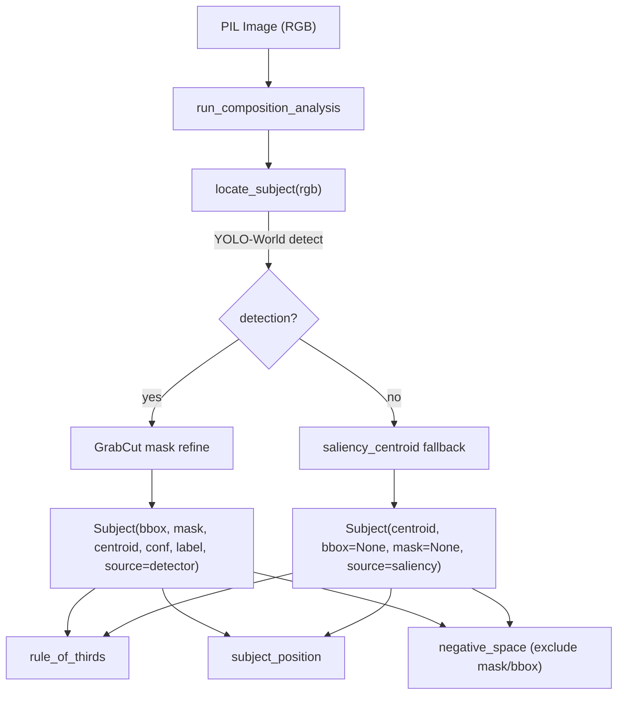

## Context: what the code actually does

The "saliency centroid" is gradient energy, not spectral residual. It lives in one shared helper:

```44:58:backend/app/services/composition/_utils.py
def saliency_centroid(gray_u8: np.ndarray) -> tuple[float, float]:
    mag = gradient_magnitude(gray_u8)
    total = float(mag.sum())
    if total <= 0:
        return 0.5, 0.5
    ...
```

Consumers today: [rule_of_thirds.py](backend/app/services/composition/rule_of_thirds.py) and [subject_position.py](backend/app/services/composition/subject_position.py). [negative_space.py](backend/app/services/composition/negative_space.py) does NOT use the centroid — it measures global flat-area ratio. Out of scope and confirmed centroid-free: [leading_lines.py](backend/app/services/composition/leading_lines.py), [horizon_detection.py](backend/app/services/composition/horizon_detection.py), [symmetry.py](backend/app/services/composition/symmetry.py), [edge_density.py](backend/app/services/composition/edge_density.py).

## Target data flow



## Key design decisions

- Detector is optional and lazy-loaded. `ultralytics` (YOLO-World, e.g. `yolov8s-worldv2.pt`) + its `torch` dependency are heavyweight; load a thread-safe singleton on first use. If import/weights/load fails, `locate_subject` falls back to the existing saliency centroid. This keeps CI and current tests green without model weights.
- New `Subject` value object centralizes "where the subject is": normalized `bbox`, optional boolean `mask` (HxW), `centroid` (mask center-of-mass if mask present, else bbox center, else saliency), `confidence`, `label`, `source` ("detector" | "saliency").
- Subject selection: run YOLO-World with a generic open-vocab prompt list, pick the best detection by a confidence x area heuristic.
- Mask refinement: GrabCut (`cv2.grabCut`, `GC_INIT_WITH_RECT`) seeded from the bbox — dependency-light. SAM-lite (MobileSAM) left as a pluggable upgrade behind the same interface.
- Backward compatibility: metric functions keep working on a bare grayscale array. New `subject` parameter is optional (`subject: Subject | None = None`); when `None`, they fall back to the current `saliency_centroid` logic. The pipeline always passes a Subject.
- negative_space: keep global low-gradient logic; if `subject.mask` present, exclude it (`low & ~mask`); elif `subject.bbox` present, exclude the bbox; if subject is `None`/saliency-only (no footprint), leave unchanged. Expose BOTH `negative_space_ratio` (raw, current) and `subject_excluded_ratio` so the two definitions can be A/B'd before changing the radar input.

## Files to change

- New `backend/app/services/composition/subject.py` — `Subject` dataclass + centroid/footprint helpers.
- New `backend/app/services/composition/subject_localization.py` — `locate_subject(rgb)`, lazy YOLO-World singleton, GrabCut refinement, saliency fallback.
- [composition_pipeline.py](backend/app/services/composition/composition_pipeline.py) — derive `rgb`, call `locate_subject`, pass `subject` into the three affected analyzers.
- [rule_of_thirds.py](backend/app/services/composition/rule_of_thirds.py) — accept optional `subject`, use `subject.centroid`; add `source` to output.
- [subject_position.py](backend/app/services/composition/subject_position.py) — accept optional `subject`; add `bbox`, `label`, `confidence`, `has_mask`, `source`.
- [negative_space.py](backend/app/services/composition/negative_space.py) — subject-aware exclusion + dual ratios.
- [schemas/analysis.py](backend/app/schemas/analysis.py) — extend `RuleOfThirds`, `SubjectPosition`, `NegativeSpace` (new optional fields, additive/non-breaking).
- [requirements.txt](backend/requirements.txt) — add `ultralytics` (pulls `torch`); pin versions.
- [frontend/src/types/analysis.ts](frontend/src/types/analysis.ts) — mirror new fields.
- [SubjectMarker.tsx](frontend/src/components/composition/SubjectMarker.tsx) / [CompositionOverlay.tsx](frontend/src/components/composition/CompositionOverlay.tsx) — optionally draw bbox/mask when present; keep crosshair.
- [tests/test_composition.py](backend/tests/test_composition.py) — keep existing grayscale-arg tests passing (validates fallback), add Subject-driven and negative-space-exclusion tests.

## Out of scope

leading_lines, horizon, symmetry, edge_density — not touched.

## Risks / notes

- `ultralytics` + `torch` significantly increase image/build size and cold-start time; mitigated by lazy load + fallback. Flag if the deployment target has size/latency limits.
- CPU inference for `yolov8s-world` on one image is ~hundreds of ms; the route is synchronous (`analysis.py:50`). Acceptable for now; note as a future async/queue candidate.
- Model weights download on first run — needs network or a vendored weights path in CI; the fallback path means tests don't require it.